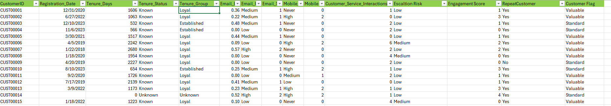
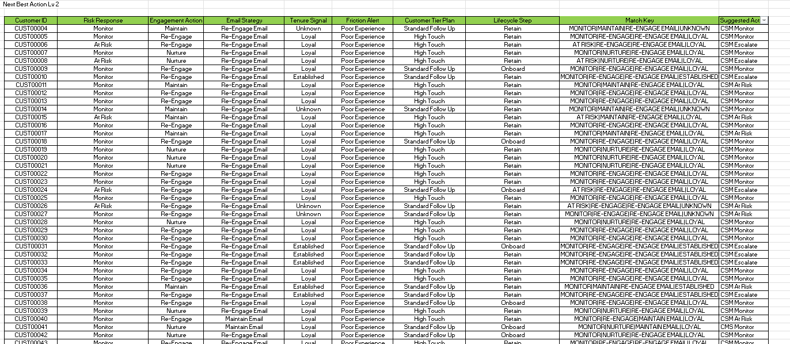
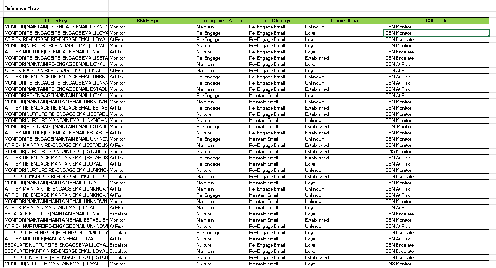
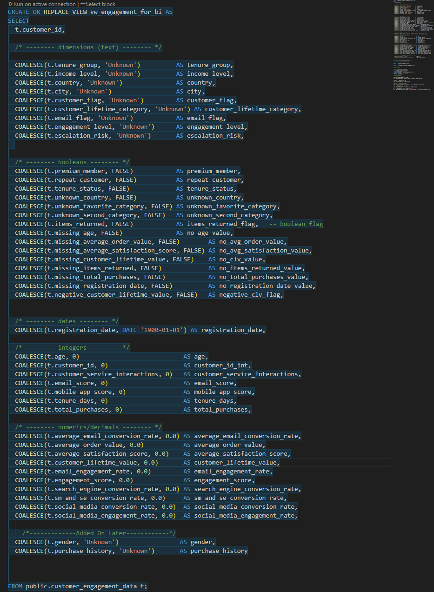
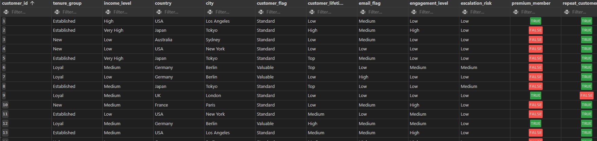

# Customer Engagement Strategy

Simulating a real-world CS Ops decision model using Excel: from data cleaning to engagement strategy.

---
## Goal: 

Simulate a real-world Customer Success Operations (CS Ops) decision model that flags at-risk customers, segments by engagement level, and recommends next actions.

This project started in Excel using formulas and match keys, then expanded into SQL views to make the model scalable and BI-ready. It reflects how CS Ops teams use structured logic (similar to Gainsight) to guide retention and engagement strategies.

---

## Business Problem

Customer Success teams often need to decide:
- Which customers are **at risk**?  
- How should we **prioritize outreach**?  
- What is the **next best action** for each customer?  
---
  
## Business Goal

Simulate an internal customer engagement model that could help a Customer Success Operations or CS Ops team:

- Identify at-risk customers  
- Segment customers by tenure, risk level, and engagement score  
- Recommend appropriate actions based on customer traits  
- Support a **Next Best Action** framework to guide team interventions  

---

## Solution Approach

**Excel Prototype:**

- Built logic-driven model with XLOOKUP, INDEX/MATCH, IF functions.
- Created Next Best Action (NBA) tables based on tenure, risk, and satisfaction.
- Developed a strategy matrix mapping customer traits to recommended actions.

**SQL Refactor (in progress):**

- Migrated Excel logic into SQL views (vw_engagement_for_bi, supporting demographic and purchase history views).
- Restructured dataset for scalability and BI integration.
- Added validation queries to compare Excel vs. SQL outputs.

## Data & Preparation 
This project uses a simulated customer dataset with: 
- Demographics and account traits
- Satisfaction scores
- Conversion rates across channels
- Loyalty and repeat purchase indicators
- Service interaction history (calls, chats, escalations) 

### Cleaning & Transformation 
**Excel (initial prototype):**
- Normalized Yes/No flags
- Grouped tenure into categories (**New, Established, Loyal**)
- Converted numeric columns for consistency
- Built calculated fields for **risk level** and **engagement status**

**SQL (scalable refactor, in progress):**  
- Began translating Excel logic into SQL views for demographics, purchase history, and service interactions  
- Used joins and match keys (with guidance) to consolidate customer records  
- Added null-handling defaults to prevent dropped customers  
- Drafted an output view (`vw_engagement_for_bi`) designed to hold risk scores, risk buckets, next-best-action, and reason codes
---
## Key Skills Demonstrated

- **Excel:** Data cleaning, advanced formulas, lookup logic.

- **SQL**: View creation, joins, data preparation for BI.

- **Ops Thinking:** SLA-style workload prioritization, at-risk flagging.

- **Documentation:** Clear definitions, assumptions, and next steps.

---
## Sample Outputs

### Cleaned Customer Data Preview

### Next Best Action Level 2 Logic Table

### Customer Engagement Strategy Matrix

To simulate Gainsight-style logic, I built two levels of recommendations:

### SQL View

### SQL View of Data 

### Next Best Action Logic

**Level 1 — Next Best Action Table**  
- Uses tenure group, risk level, and satisfaction score  
- Recommends Monitor, Maintain, Re-engage, or Escalate  

**Level 2 — Strategy Matrix**  
- Combines Level 1 recommendations with email strategy + tenure signals  
- Maps combinations of traits to a final suggested action via reference matrix  

**Excel logic:**  
- IF and XLOOKUP functions  
- Concatenated 4-attribute match key  
- Lookup against a reference matrix to assign strategy

## SQL Logic (Refactor of Excel Model)

To make the engagement model scalable, I began refactoring the Excel logic into SQL views.  
The goal is to mirror the Excel calculations (risk flags, match keys, next-best-action logic) in a repeatable, queryable form and prepare a BI-ready dataset for future Power BI reporting.  
This refactor is still in progress, but the structure below outlines the key views and logic already drafted.

### Key Components
- **Core Views**
  - `vw_engagement_for_bi` → main BI-ready dataset (customer_id, risk_score, bucket, next_best_action, reasons).
  - `vw_customer_demographics` → age, tenure, and account traits.
  - `vw_purchase_history` → recency, frequency, and total purchase counts.
  - `vw_service_interactions` → last contact, service issue counts, escalation flags.

- **Logic Implemented**
  - Risk scoring using tenure, purchase history, and service interactions.
  - Concatenated match keys (customer attributes) for lookups against strategy matrix.
  - SLA-style workload distribution fields for analyst reporting.
  - Null handling defaults to prevent dropped customers.

- **Validation Checks**
  - Row counts, key coverage, and null checks.
  - Spot-checked Excel vs SQL outputs to confirm parity with original logic.

---

## Next Steps

- Complete SQL validation and finalize BI-ready dataset.

- Build a Power BI report to visualize engagement segments and workload distribution.

- Compare Excel/SQL approach to Gainsight’s NBA functionality.

## Why I Built This Project

I built this project to practice structuring engagement data into a decision model, simulating how CS Ops teams use tools like Gainsight. It gave me hands-on experience turning raw data into action recommendations, while deepening my Excel fluency and preparing to scale the logic in SQL and Power BI.

## Tools Used
- Excel: Data cleaning, XLOOKUP, IF, match keys.

- SQL: Views for engagement scoring, segmentation, and action logic.

- Power BI (planned): Future reporting layer.

---

## Role Alignment & Takeaways

This project demonstrates how an analyst can:

- Turn raw customer data into actionable insights.

- Structure repeatable decision logic for at-risk customers.

- Support operations teams with both Excel-based tools and scalable SQL datasets.

---

## Contact

**Name:** Aaron Zeug  
- Based in Minnesota — Open to remote or hybrid roles  
- [LinkedIn](https://linkedin.com/in/aaronzeug)  
- [GitHub](https://github.com/Gray135)
