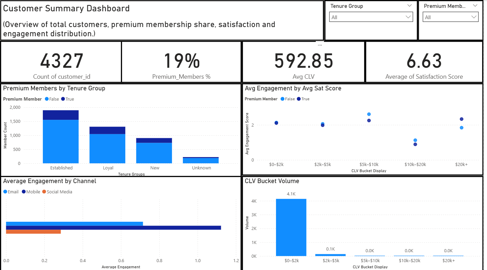
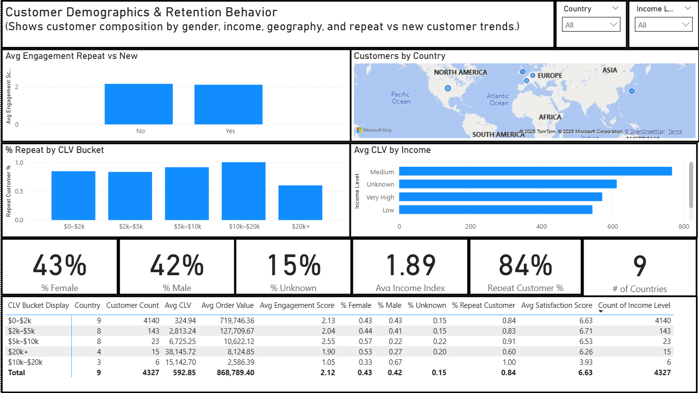
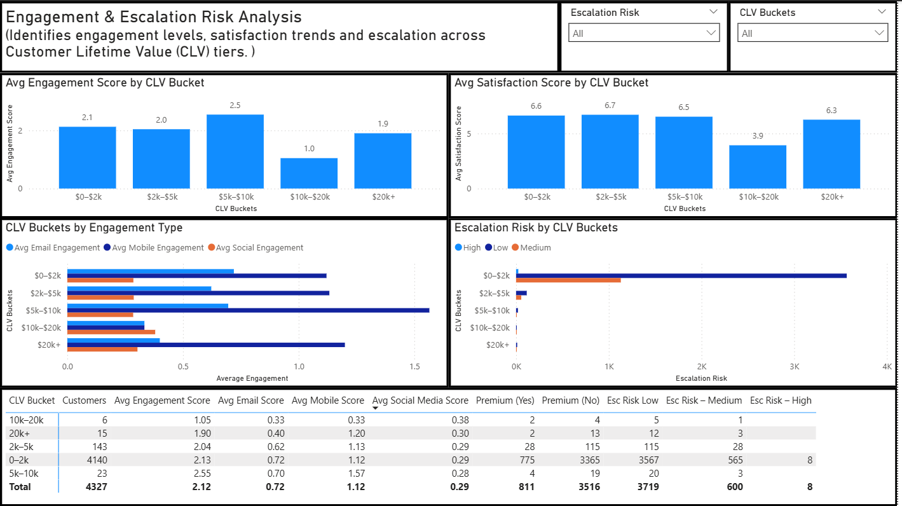
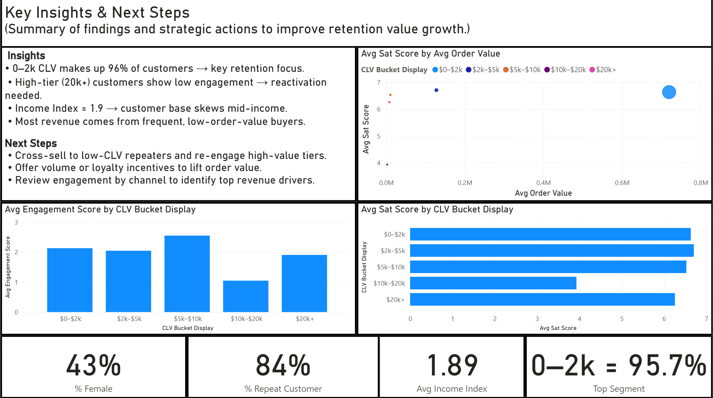

# How to Read this Repo
- **Start here:** Scroll to the [Dashboard Preview](#dashboard-preview) to see the Power BI visuals.
- **[Excel prototype](excel/):** Early exploration of customer engagement patterns and the “Next Best Action” framework, illustrated through screenshots.
- **[SQL views](sql/):** Scalable data preparation layer for BI, built to mirror Excel logic and feed Power BI.
- **[Access the Dashboard](dashboard/customer_engagement_strategy.pbix):** click the file in GitHub, then click "Raw" to download
- **Quick skim:** This README explains the business goal, visuals, and insights.

---

# 💬 Customer Engagement Strategy

## Using Excel, SQL, and Power BI to Simulate a Real-World CS Ops Decision Model

This project simulates how a Customer Success Operations (CS Ops) or Customer Success team might use data to monitor customer health, flag at-risk accounts, and guide retention outreach.

**Main goal:** build a working engagement model that connects Excel logic, SQL views, and a Power BI dashboard to answer:
- Which customers are at risk?
- What drives engagement and satisfaction?
- Where should the team focus first?

This is the first version that includes a Power BI reporting layer. The dashboard turns the Excel + SQL decision logic into interactive visuals that show:
- Customer Lifetime Value (CLV) tiers
- Engagement and satisfaction levels
- Repeat vs new customer behavior
- Escalation risk by segment

This is meant to feel like a real CS Ops playbook: “Who do we worry about, and why?”

**Tools & approach**
- **Excel:** cleaned the raw data, built the first version of “Next Best Action” logic using IF / XLOOKUP / INDEX-MATCH
- **SQL:** translated that logic into views so it can scale and feed BI
- **Power BI:** built multi-page dashboards to surface retention risks and action paths

**Dashboard pages**
1. **Customer Summary** — CLV, premium mix, engagement by channel, satisfaction
2. **Demographics & Retention** — gender, income, repeat rate, CLV distribution
3. **Engagement & Escalation Risk** — satisfaction vs engagement and where risk sits
4. **Key Insights & Next Steps** — what to do with this data

---

## Table of Contents
- [Dashboard Preview](#dashboard-preview)
- [Business Objective](#business-objective)
- [Key Insights From the Dashboard](#key-insights-from-the-dashboard)
- [Next Steps](#next-steps)
- [Data Source](#data-source)
- [Data Preparation and Logic](#data-preparation-and-logic)
- [SQL Views](#sql-views)
- [Real World Role Alignment](#real-world-role-alignment)
- [Folder Structure](#folder-structure)
- [Reflection](#reflection)
- [Contact](#contact)
- [Disclaimer](#disclaimer)

---

## Dashboard Preview

The dashboard connects Excel logic, SQL structuring, and Power BI visuals to simulate how a CS Ops / retention team might prioritize outreach.

It highlights how CLV, engagement score, satisfaction score, and escalation risk show up across different customer segments.

### 🔑 Key Metrics

| **Metric**                    | **Value / Description**                          |
|------------------------------|--------------------------------------------------|
| Total Customers              | 4,327                                            |
| Premium Members              | ~19% of total base                               |
| Avg CLV                      | $592.85                                          |
| Avg Satisfaction Score       | 6.63 / 10                                        |
| Repeat Customer Rate         | 84%                                              |
| Top Segment by Volume        | $0–2k CLV (95.7% of all customers)               |
| Avg Income Index             | ~1.89 (skews mid-income / not luxury)            |

> These metrics come from simulated customer data and are used to model retention strategy, not to report on any real business.

---

### 1. Customer Summary Dashboard

What it shows:
- High-level KPIs (total customers, premium % share, average CLV, satisfaction)
- Premium membership count by tenure group
- Engagement by satisfaction band and CLV tier
- Channel engagement (email, mobile, social)
- CLV bucket volume

How a CS Ops lead would use it:
- “What does our customer base look like right now?”
- “Which slice is big enough to actually matter?”

---

### 2. Demographics & Retention Behavior

What it shows:
- % Female / % Male / % Unknown
- Repeat vs new customer engagement
- CLV by income level
- Customer count by country
- A table with all major metrics (CLV bucket, count, average engagement score, repeat %, satisfaction score, etc.)

How a CS Ops lead would use it:
- “Where are we strong with repeat buyers?”
- “Does higher CLV line up with higher satisfaction or just higher spend?”
- “Which income bands are actually driving value?”

---

### 3. Engagement & Escalation Risk

What it shows:
- Avg engagement score by CLV bucket
- Avg satisfaction score by CLV bucket
- Engagement by channel (email, mobile, social) across CLV tiers
- Escalation risk split across CLV buckets (Low / Medium / High)

How a CS Ops / Support Ops lead would use it:
- “Are high-value customers actually engaged, or are they quietly unhappy?”
- “Where do we see higher escalation risk, and is it concentrated in a revenue-critical segment?”

---

### 4. Key Insights & Next Steps

What it shows:
- A summary of what matters (ex: “0–2k CLV makes up ~96% of customers → core retention focus”)
- A summary of what to do next (cross-sell low-CLV repeaters, re-engage high-value tiers that stopped engaging, etc.)
- Supporting visuals (engagement score by CLV tier, satisfaction score by CLV tier)

This page basically acts like the slide you’d send to leadership.

---

## Business Objective

Customer Success / CS Ops teams need a way to answer:
- Who is at risk?
- Who should we contact first?
- Are we losing high-value customers because they’re disengaging, or are we mostly dealing with low-value noise?

The goal of this project is to simulate that workflow:
1. Flag at-risk customers
2. Segment them by CLV, engagement score, and satisfaction
3. Recommend a “next best action” style response

This is built to feel like the early version of something you’d run in Gainsight or a CS Ops health dashboard.

---

## Key Insights From the Dashboard

These are examples of what you’d hand to stakeholders:

- **Most of the base is low CLV.** ~96% of customers fall in the $0–2k CLV bucket. That group basically *is* the business. Retention work has to start here or it doesn’t scale.
- **High-CLV ($20k+) customers show lower engagement.** That’s a red flag. They’re valuable but less active. Reactivation work needs to be targeted, fast, and probably personal.
- **Repeat rate is high (84%).** Strong signal for loyalty. This is not a “one and done” customer base.
- **Income Index ~1.9.** The majority of spend is coming from mid-income tiers, not ultra-high income. Meaning: don’t build a strategy that assumes luxury buyer behavior.
- **Channel engagement is not equal.** Some segments engage mostly by mobile or email. That matters for outreach planning (who you email vs who you have to call or escalate).

These findings are surfaced visually in the Power BI pages, and they link back to the Excel / SQL logic for “risk” and “next best action.”

---

## Next Steps

Where this project is going next:
- Add time-based metrics (trend over time instead of just a snapshot)
- Automate the data refresh instead of manually exporting to Power BI
- Add a light churn-risk score that blends:
  - engagement score
  - satisfaction score
  - escalation risk
  - CLV tier
- Tighten parity between:
  - Excel “Next Best Action” logic (Level 1 / Level 2)
  - SQL views feeding Power BI

Long-term idea:
- Treat this as the backbone for a workload routing model (“who do we work today and why?”).

---

## Data Source

All data here is simulated.

The dataset is structured to look like what a CS Ops or CX analytics team might have access to:
- Customer demographics (gender, income level, tenure group)
- CLV and order value
- Engagement score and satisfaction score
- Premium membership flag
- Repeat vs new status
- Escalation risk level
- Channel engagement (email, mobile, social)

No real customer data is used.

---

## Data Preparation and Logic

### Excel (prototype stage)
- Cleaned Yes/No flags and normalized numeric columns
- Grouped tenure into categories (New, Established, Loyal, etc.)
- Built “Next Best Action” logic:
  - Level 1 = basic recommendation (Monitor / Maintain / Re-engage / Escalate)
  - Level 2 = strategy matrix that combines tenure, risk, satisfaction, etc.
- Used `IF`, `XLOOKUP`, `INDEX/MATCH`, and concatenated match keys to assign actions

### SQL (scaling the logic)
- Built SQL views to mirror the Excel logic in a more repeatable way:
  - `vw_engagement_for_bi` → main BI-ready view with CLV, engagement, satisfaction, risk, next_best_action, reasons
  - `vw_customer_demographics` → tenure, income level, gender
  - `vw_purchase_history` → order volume, repeat vs new
  - `vw_service_interactions` → escalation flags, last contact
- Added null-handling defaults so customers don’t drop out of the view
- Started validating Excel output vs SQL output (row counts, coverage, etc.)

### Power BI (visual layer)
- Modeled the dataset in Power BI
- Created measures for:
  - Premium member %
  - Repeat customer %
  - Avg CLV
  - Avg engagement score
  - Avg satisfaction score
- Built four report pages to surface retention and risk patterns in a way that would make sense to operations leadership

---

## SQL Views

These are the core building blocks behind the dashboard:

- `vw_engagement_for_bi`
  - Customer ID
  - CLV and CLV bucket
  - Engagement score / Satisfaction score
  - Escalation risk
  - Next best action / reason

- `vw_customer_demographics`
  - Gender
  - Income level
  - Tenure group
  - Country / region

- `vw_purchase_history`
  - Total order value
  - Repeat flag
  - Recency / frequency signals

- `vw_service_interactions`
  - Tickets / escalations
  - Last touch channel
  - Risk notes

These are meant to simulate how data teams prepare a clean, BI-ready view for Customer Success or Support Ops.

---

## Real World Role Alignment

This project mirrors typical work for:
- Customer Success Operations / CS Ops Analyst
- Customer Experience (CX) / Voice of Customer Analyst
- Business Analyst supporting Retention / Loyalty
- Support Operations Analyst (escalation + health monitoring)

Skills shown here:
- Data cleaning and prep in Excel
- Translating manual logic into SQL views
- Building a BI model in Power BI
- Turning raw metrics into outreach strategy, not just charts

This is the exact type of work you’d be expected to explain in an interview:
“How do you know who to focus on first, and why?”

---

## Folder Structure

- `excel/` – Early logic tables and “Next Best Action” mapping
- `sql-views/` – SQL views and validation queries
- `images/` – Power BI dashboard screenshots used in this README
- `dashboard/customer_engagement_strategy.pbix` – Power BI report file
- `README.md` – Project overview, visuals, insights, and next steps

(Adjust folder names if yours differ. The structure above is the intention.)

---

## Reflection

This project helped me practice something that’s hard to show on a resume:
- Going from messy inputs → structured logic → scalable views → dashboard
- Thinking like CS Ops, not just “make a chart”
- Explaining “who do we contact and why” using data instead of gut feeling

I’m using this project to build confidence with:
- Power BI data modeling and DAX
- Writing SQL views that match business logic
- Translating CX / CS Ops concepts into something a leadership team could actually use

---

## Contact

**Aaron Zeug**  
Customer Experience & Reporting Specialist  
Focused on data analytics, retention strategy, and building repeatable CS Ops workflows.  
GitHub: https://github.com/Gray135  
LinkedIn: https://linkedin.com/in/aaronzeug

---

## Disclaimer

All data is simulated and for portfolio/demo purposes only.  
Nothing in this repo reflects real customer behavior from any employer.  
This work is meant to demonstrate workflow, logic design, and dashboard build-out.
